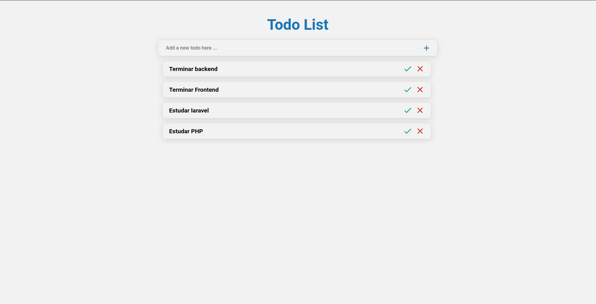

# :pushpin: PHP-TodoApp-Frontend :pushpin:

An Rest-api for todo app, for study php language.

<br>



<br>

## :thinking: How to run

<br>

💭 Remember to download and run the <a href="https://github.com/martins20/PHP-TodoApp-Backend">backend</a>.

<br>

**:one: Clone the repository.**

```
$ git clone https://github.com/martins20/PHP-TodoApp-Frontend.git

$ cd PHP-TodoApp-Frontend
```

**:two: Set .env file cloning the example.**

```
$ cp .env.example .env
```

**:three: install all dependencies.**

```
$ yarn
```

**:four: Start the project.**

```
$ yarn start or npm runs start
```

### :wrench: Technologies

- [x] Typescript
- [x] React
- [x] Unform
- [x] Styled Components
- [x] Axios
- [x] Yup

#### Made with for :heart: <a href="https://www.github.com/martins20">Martins20</a> :heart:
